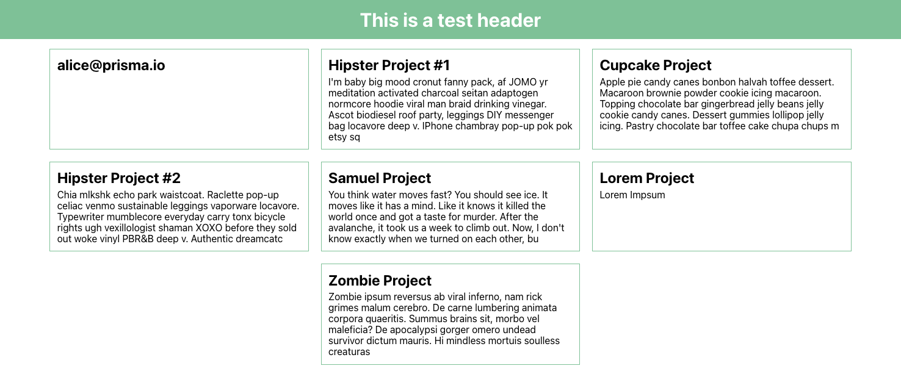

# Frontend

## Pre-Requisites

This frontend expects the [example-app-backend](https://github.com/stehefan/example-app-backend-nextjs) to run, using
its APIs to retrieve data it displays. Make sure to check this out and start it on its default port `8080`. Read the
documentation of the Backend if you have any other question. And feel free to open a [pull-request](https://github.com/stehefan/example-app-frontend/pulls)
if you see any mistake, want to add documentation or fix any bug you find.

Before running the frontend, you'll have to install all dependencies the application needs:

```shell
# Using yarn
yarn install

# Using npm
npm install
```

## Running the Frontend

To run the Frontend, we're using the `create-react-app` wrapper which can be used to start a dev-server in our local
environment:

```shell
# Using yarn
yarn start

# Using npm
npm start
```

Afterward, your browser should open the local server on `http://localhost:3000` and display a list of projects, if the
backend got initialized correctly.



## Additional Information

More on everything react can be found in the documentation of [create-react-app](https://create-react-app.dev/docs/getting-started)
and in the official documentation of [react.dev](https://react.dev/learn).
